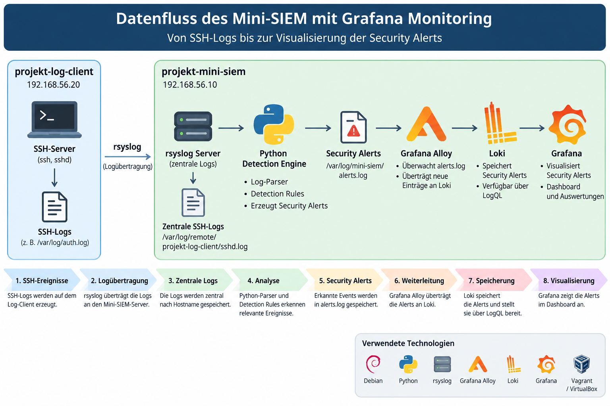

# Architektur

## Übersicht

Das bestehende Python-basierte Mini-SIEM wird um eine zentrale Log- und Monitoring-Pipeline erweitert.

Die Umgebung besteht aus zwei virtuellen Debian-Systemen. Der `projekt-log-client` erzeugt SSH-Authentifizierungsereignisse und überträgt diese mit rsyslog an den `projekt-mini-siem`. Dort analysiert die Python-basierte Detection Engine die zentral gesammelten SSH-Logs und erzeugt strukturierte Security Alerts.

Grafana Alloy überträgt diese Alerts an Loki. Grafana verwendet Loki als Datenquelle und visualisiert die Security Alerts über LogQL-Abfragen.

## Systemarchitektur

Die folgende Abbildung zeigt die beteiligten Systeme und Komponenten:


Die Projektumgebung besteht aus zwei virtuellen Maschinen:

| VM | IP-Adresse | Komponenten |
|---|---|---|
| `projekt-mini-siem` | `192.168.56.10` | rsyslog Server, Python Mini-SIEM, Grafana Alloy, Loki, Grafana |
| `projekt-log-client` | `192.168.56.20` | SSH-Server, rsyslog Client |

Die virtuellen Maschinen werden mit Vagrant und VirtualBox auf Basis von Debian Bookworm betrieben. Für die Kommunikation zwischen den Projekt-VMs wird das private Netzwerk `192.168.56.0/24` verwendet.

## Zentrale Logübertragung

Der `projekt-log-client` überträgt relevante Logs mit rsyslog über UDP Port 514 an den Mini-SIEM-Server.

Die Konfiguration befindet sich unter:

```text
config/rsyslog-client.conf
config/rsyslog-server.conf
```

Die empfangenen Logs werden auf dem Mini-SIEM nach Hostname und Programm abgelegt. Die SSH-Logs des Log-Clients befinden sich unter:

```text
/var/log/remote/projekt-log-client/sshd.log
```

Damit steht der Detection Engine eine zentrale Quelle für die Analyse der SSH-Ereignisse zur Verfügung.

## Python Mini-SIEM

Das Python Mini-SIEM übernimmt Parsing und regelbasierte Erkennung sicherheitsrelevanter SSH-Ereignisse.

Der Parser liest die zentral gespeicherten SSH-Logs und überführt relevante Ereignisse in eine strukturierte Form. Die Detection Engine wertet diese Events anschliessend anhand der konfigurierten Detection Rules aus.

Die Python-Komponenten und die zugehörige Konfiguration befinden sich unter:

```text
src/mini_siem/
config/siem.yaml
```

Folgende Detection Rules sind implementiert:

| Rule ID | Severity | Erkennung |
|---|---|---|
| `SIEM-SSH-001` | WARNING | Mehrere fehlgeschlagene SSH-Anmeldungen |
| `SIEM-SSH-002` | CRITICAL | Möglicher SSH-Brute-Force-Angriff |
| `SIEM-SSH-003` | SUSPICIOUS | SSH-Anmeldung mit ungültigem Benutzer |
| `SIEM-SSH-004` | HIGH | Erfolgreiche SSH-Anmeldung nach mehreren Fehlversuchen |

Erkannte Security Events werden als strukturierte Alerts unter folgendem Pfad gespeichert:

```text
/var/log/mini-siem/alerts.log
```

Beispiel:

```text
timestamp=... | rule_id=SIEM-SSH-001 | severity=WARNING | source_ip=127.0.0.1 | attempts=6 | message=Multiple failed SSH login attempts detected
```

## Grafana Alloy

Grafana Alloy überwacht die Alert-Datei:

```text
/var/log/mini-siem/alerts.log
```

Neue Einträge werden mit dem Job-Label:

```text
job="mini-siem"
```

an die lokale Loki-Instanz übertragen.

Die Konfiguration befindet sich unter:

```text
config/alloy/config.alloy
```

Die Übertragung erfolgt über den lokalen Loki-Endpunkt:

```text
http://127.0.0.1:3100/loki/api/v1/push
```

Die Detection Engine bleibt dadurch unabhängig von Loki und Grafana. Ihre Aufgabe endet mit der Erzeugung der strukturierten Alert-Datei.

## Loki und LogQL

Loki speichert die von Grafana Alloy übertragenen Security Alerts und stellt sie für Abfragen durch Grafana bereit.

Die grundlegende LogQL-Abfrage für die Mini-SIEM-Alerts lautet:

```logql
{job="mini-siem"}
```

Strukturierte Informationen wie `severity`, `rule_id` oder `source_ip` werden zur Abfragezeit aus den Alert-Zeilen extrahiert.

Beispiel für die Auswertung nach Severity:

```logql
sum by (severity) (
  count_over_time(
    {job="mini-siem"}
    | regexp "severity=(?P<severity>[^ |]+)"
    [$__range]
  )
)
```

Damit können die erzeugten Alerts ohne zusätzliche Datenbank für die Visualisierung ausgewertet werden.

## Grafana

Grafana verwendet Loki als automatisch provisionierte Datenquelle.

Die Konfiguration befindet sich unter:

```text
config/grafana/provisioning/datasources/loki.yml
```

Das Dashboard `Mini-SIEM Security Monitoring` enthält fünf Panels:

1. Total Security Alerts
2. Alerts by Severity
3. Alerts by Rule
4. Alerts by Source IP
5. Recent Security Alerts


Das Dashboard selbst sowie dessen Provisionierung befinden sich unter:

```text
config/grafana/dashboards/mini-siem-security-monitoring.json
config/grafana/provisioning/dashboards/mini-siem.yml
```

## Architekturentscheidungen

Die Komponenten wurden nach klar getrennten Verantwortlichkeiten aufgebaut:

| Komponente | Verantwortung |
|---|---|
| rsyslog | zentrale Übertragung und Ablage der SSH-Logs |
| Python Mini-SIEM | Parsing und regelbasierte Erkennung |
| Grafana Alloy | Sammlung und Weiterleitung der Security Alerts |
| Loki | Speicherung und Abfrage der Alerts |
| Grafana | Visualisierung und Analyse |
| Vagrant | reproduzierbarer Aufbau der Umgebung |

Auf eine zusätzliche Datenbank sowie einen weiteren Such-Stack wie Elasticsearch oder OpenSearch wurde bewusst verzichtet. Loki deckt die Anforderungen an Speicherung und Abfrage der erzeugten Security Alerts ab und hält die Anzahl der benötigten Komponenten gering.

Die Installation und Konfiguration der Monitoring-Komponenten erfolgt über:

```text
provision/monitoring.sh
```

Dadurch werden Loki, Grafana Alloy und Grafana sowie die Loki-Datenquelle und das Dashboard beim Aufbau der Umgebung automatisch eingerichtet.

## Datenfluss

Die folgende Abbildung zeigt den vollständigen technischen Datenfluss:



Ein SSH-Ereignis durchläuft dabei folgende Verarbeitungsschritte:

1. Der `projekt-log-client` erzeugt ein SSH-Authentifizierungsereignis.
2. rsyslog überträgt das Log an `projekt-mini-siem`.
3. Der rsyslog-Server speichert das Ereignis in der zentralen SSH-Logdatei.
4. Das Python Mini-SIEM analysiert das Ereignis anhand der Detection Rules.
5. Ein erkannter Security Event wird in `alerts.log` geschrieben.
6. Grafana Alloy überträgt den Alert an Loki.
7. Grafana fragt die Daten mit LogQL aus Loki ab.
8. Das Dashboard visualisiert die Security Alerts.