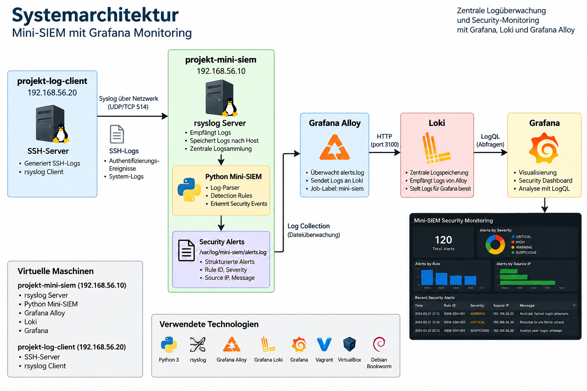

# Architektur

## Übersicht

Die Projektarbeit erweitert ein bestehendes Python-basiertes Mini-SIEM um eine zentrale Monitoring- und Visualisierungspipeline.

Die Umgebung besteht aus zwei virtuellen Debian-Systemen. Der `projekt-log-client` erzeugt SSH-Logs und überträgt diese über rsyslog an den zentralen `projekt-mini-siem`.

Auf dem Mini-SIEM-Server analysiert eine Python-basierte Detection Engine die zentral gesammelten SSH-Ereignisse. Erkannte Security Events werden als strukturierte Alerts gespeichert.

Grafana Alloy überwacht die Alert-Datei und überträgt neue Einträge an Loki. Grafana verwendet Loki als Datenquelle und stellt die Security Alerts über LogQL in einem zentralen Dashboard dar.

## Systemarchitektur

Die folgende Abbildung zeigt die beteiligten Systeme und Komponenten.



## Virtuelle Maschinen

Die Projektumgebung besteht aus zwei virtuellen Maschinen:

| VM | IP-Adresse | Komponenten |
|---|---|---|
| `projekt-mini-siem` | `192.168.56.10` | rsyslog Server, Python Mini-SIEM, Grafana Alloy, Loki, Grafana |
| `projekt-log-client` | `192.168.56.20` | SSH-Server, rsyslog Client |

Die virtuellen Maschinen werden mit Vagrant und VirtualBox erstellt. Als Betriebssystem wird Debian Bookworm verwendet.

Die Trennung in zwei Systeme ermöglicht es, die Logerzeugung und die zentrale Verarbeitung voneinander zu separieren und die Logübertragung zwischen unterschiedlichen Hosts zu testen.

## Zentrale Logübertragung

Der `projekt-log-client` erzeugt unter anderem SSH-Authentifizierungsereignisse.

rsyslog überträgt die relevanten Logs über das interne Lab-Netzwerk an den Mini-SIEM-Server. Die konfigurierte Logübertragung verwendet UDP auf Port `514`.

Die empfangenen Logs werden auf dem Mini-SIEM nach Hostname und Programm gespeichert.

Für die SSH-Logs des Log-Clients wird beispielsweise folgende Datei verwendet:

```text
/var/log/remote/projekt-log-client/sshd.log
```

Dadurch kann die Detection Engine die zentral gesammelten SSH-Ereignisse unabhängig vom ursprünglichen System analysieren.

## Python Mini-SIEM

Das Mini-SIEM besteht aus einem SSH-Parser und einer regelbasierten Detection Engine.

Der Parser erkennt relevante SSH-Ereignisse und wandelt sie in eine strukturierte Form um. Die Detection Engine wertet diese Events anschliessend anhand definierter Security-Regeln aus.

Folgende Detection Rules sind implementiert:

| Rule ID | Severity | Beschreibung |
|---|---|---|
| `SIEM-SSH-001` | WARNING | Mehrere fehlgeschlagene SSH-Anmeldungen |
| `SIEM-SSH-002` | CRITICAL | Möglicher SSH-Brute-Force-Angriff |
| `SIEM-SSH-003` | SUSPICIOUS | SSH-Anmeldung mit ungültigem Benutzer |
| `SIEM-SSH-004` | HIGH | Erfolgreiche SSH-Anmeldung nach mehreren Fehlversuchen |

Erkannte Security Alerts werden unter folgendem Pfad gespeichert:

```text
/var/log/mini-siem/alerts.log
```

Ein Alert enthält abhängig von der Detection Rule unter anderem folgende Informationen:

```text
timestamp
rule_id
severity
source_ip
attempts
username
message
```

Beispiel:

```text
timestamp=... | rule_id=SIEM-SSH-001 | severity=WARNING | source_ip=... | attempts=6 | message=...
```

## Grafana Alloy

Grafana Alloy bildet die Schnittstelle zwischen der Detection Engine und Loki.

Alloy überwacht:

```text
/var/log/mini-siem/alerts.log
```

Die Security Alerts werden mit folgendem Job-Label versehen:

```text
job="mini-siem"
```

Anschliessend werden neue Logeinträge an die lokale Loki-Instanz übertragen.

Die Alloy-Konfiguration befindet sich im Repository unter:

```text
config/alloy/config.alloy
```

Die Detection Engine besitzt dadurch keine direkte Abhängigkeit zu Loki oder Grafana.

## Loki

Loki dient als zentraler Logspeicher für die vom Mini-SIEM erzeugten Security Alerts.

Grafana Alloy überträgt die Alert-Einträge an:

```text
http://127.0.0.1:3100
```

Grafana verwendet Loki anschliessend als automatisch provisionierte Datenquelle.

Die Auswertung erfolgt mit LogQL. Strukturierte Informationen wie `severity`, `rule_id` und `source_ip` werden bei den entsprechenden Dashboard-Abfragen aus den Alert-Zeilen extrahiert.

## Grafana

Grafana übernimmt die Visualisierung und Auswertung der in Loki gespeicherten Security Alerts.

Das Dashboard trägt den Namen:

```text
Mini-SIEM Security Monitoring
```

Es enthält fünf zentrale Panels:

1. Total Security Alerts
2. Alerts by Severity
3. Alerts by Rule
4. Alerts by Source IP
5. Recent Security Alerts

Damit können sowohl die Gesamtzahl der Security Alerts als auch deren Severity-Stufen, Detection Rules und beteiligte Source-IPs ausgewertet werden.


## Architekturentscheidungen

Die Architektur wurde bewusst modular aufgebaut. Die Komponenten besitzen klar getrennte Verantwortlichkeiten:

| Komponente | Verantwortung |
|---|---|
| rsyslog | zentrale Übertragung und Ablage der SSH-Logs |
| Python Mini-SIEM | Parsing und regelbasierte Erkennung sicherheitsrelevanter Ereignisse |
| Grafana Alloy | Sammlung und Weiterleitung der erzeugten Security Alerts |
| Loki | Speicherung und Abfrage der Security Alerts |
| Grafana | Visualisierung und Analyse über LogQL |

Die Detection Engine schreibt ihre Ergebnisse in eine Logdatei und besitzt keine direkte Abhängigkeit zu Loki oder Grafana. Dadurch kann die Erkennungslogik unabhängig von der Monitoring- und Visualisierungsschicht getestet und weiterentwickelt werden.

Auf eine zusätzliche Datenbank oder einen weiteren Such-Stack wie Elasticsearch oder OpenSearch wurde bewusst verzichtet. Für den definierten Projektumfang reicht Loki als Logspeicher aus und reduziert gleichzeitig die Anzahl der zu installierenden und zu betreibenden Komponenten.

Auch auf ein eigenes Web-Frontend wurde verzichtet. Grafana stellt die für die Projektziele benötigten Funktionen zur Abfrage und Visualisierung bereits zur Verfügung.

Die Infrastruktur wird mit Vagrant und Shell-Provisionierung reproduzierbar aufgebaut. Die relevanten Konfigurationen für rsyslog, Alloy, Grafana und das Dashboard befinden sich versioniert im Repository.

## Fachliche Vertiefung

Das bestehende Mini-SIEM bildet die Grundlage für Parsing und regelbasierte Erkennung von SSH-Ereignissen.

Im Rahmen dieser Projektarbeit wurde diese bestehende Lösung um eine zentrale Monitoring-Architektur erweitert.

Die wesentlichen zusätzlichen Aspekte sind:

- zentrale Übertragung von SSH-Logs zwischen getrennten Systemen mit rsyslog
- Trennung zwischen Detection Engine und Monitoring-Pipeline
- kontinuierliche Weiterleitung erzeugter Security Alerts mit Grafana Alloy
- zentrale Speicherung der Security Alerts in Grafana Loki
- Auswertung strukturierter Alert-Informationen mit LogQL
- Visualisierung sicherheitsrelevanter Kennzahlen in Grafana
- automatische Provisionierung der Loki-Datenquelle
- automatische Provisionierung des Grafana-Dashboards
- reproduzierbarer Aufbau der gesamten Umgebung mit Vagrant

Damit wird die bestehende lokale Detection Engine in eine mehrstufige Security-Monitoring-Pipeline integriert, bei der Logerzeugung, Logtransport, Analyse, Alert-Weiterleitung, Speicherung und Visualisierung getrennte Aufgaben übernehmen.

## Automatische Provisionierung

Die Projektumgebung wird mit Vagrant reproduzierbar aufgebaut.

Die Monitoring-Konfiguration befindet sich vollständig im Git-Repository. Dazu gehören unter anderem:

```text
config/alloy/config.alloy
config/grafana/dashboards/mini-siem-security-monitoring.json
config/grafana/provisioning/dashboards/mini-siem.yml
config/grafana/provisioning/datasources/loki.yml
```

Die Installation und Konfiguration der Monitoring-Komponenten erfolgt über:

```text
provision/monitoring.sh
```

Beim Aufbau der VM werden Loki, Grafana Alloy und Grafana installiert und gestartet. Zusätzlich werden die Loki-Datenquelle und das Mini-SIEM-Dashboard automatisch provisioniert.

Dadurch kann die gesamte Umgebung mit folgendem Befehl aufgebaut werden:

```powershell
vagrant up
```

Ein manueller Aufbau der Grafana-Datenquelle oder des Dashboards ist nach der Provisionierung nicht erforderlich.

## Datenfluss

## Systemarchitektur

Die folgende Abbildung zeigt die beteiligten Systeme und Komponenten.

