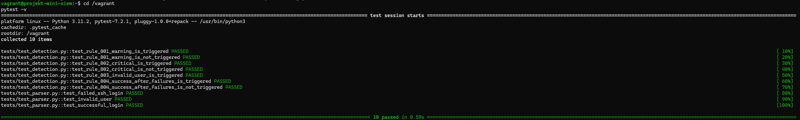
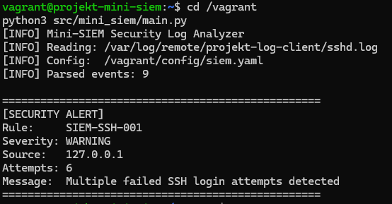
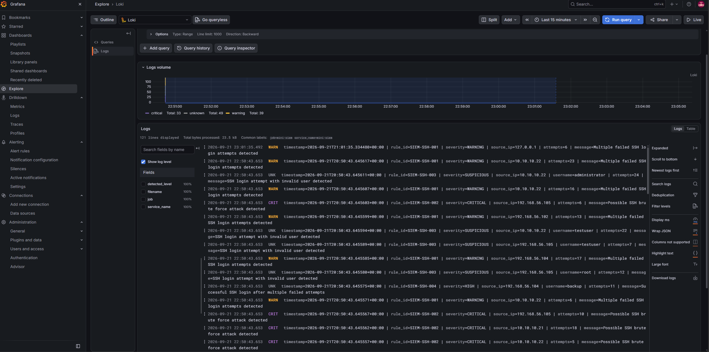
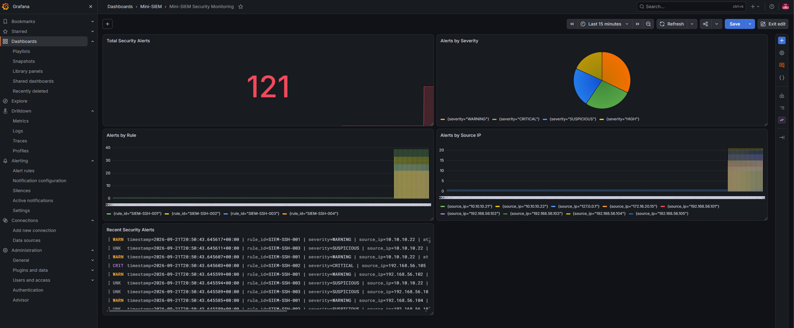
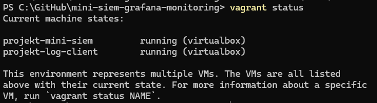

# Tests und Validierung

## Ziel

Die Projektumgebung wurde mit automatisierten Tests sowie einem vollständigen End-to-End-Test überprüft.

Validiert wurden:

- zentrale Übertragung der SSH-Logs
- Erkennung relevanter SSH-Ereignisse durch den Parser
- Auslösung der definierten Detection Rules
- persistente Speicherung erzeugter Security Alerts
- Übertragung der Alerts durch Grafana Alloy
- Speicherung und Abfrage der Alerts in Loki
- Visualisierung der Alerts in Grafana
- automatisierte Provisionierung
- Funktionsfähigkeit nach einem vollständigen Neuaufbau

## Automatisierte Tests

Für den Parser und die Detection Rules stehen automatisierte Tests mit `pytest` zur Verfügung.

Zuerst wird eine Verbindung zum Mini-SIEM-Server hergestellt:

```powershell
vagrant ssh projekt-mini-siem
```

Anschliessend werden die Tests innerhalb der VM ausgeführt:

```bash
cd /vagrant
pytest -v
```

Die Test-Suite überprüft den SSH-Parser sowie die implementierten Detection Rules.

Das Testergebnis:

```text
10 passed
```



## End-to-End-Test

Zusätzlich zu den automatisierten Tests wurde die vollständige Verarbeitungskette mit real erzeugten SSH-Fehlversuchen getestet.

### SSH-Fehlversuche erzeugen

Auf dem Log-Client wurde eine SSH-Anmeldung mit absichtlich falschem Passwort durchgeführt:

```bash
ssh -o PreferredAuthentications=password \
    -o PubkeyAuthentication=no \
    -o StrictHostKeyChecking=no \
    testuser@127.0.0.1
```

Mehrere fehlgeschlagene Login-Versuche erzeugen entsprechende Einträge im SSH-Log des Log-Clients.

### Zentrale Logübertragung

Die SSH-Logs werden über rsyslog an den Mini-SIEM-Server übertragen und dort zentral gespeichert:

```text
/var/log/remote/projekt-log-client/sshd.log
```

Damit wird geprüft, dass die zentrale Logübertragung vom `projekt-log-client` zum `projekt-mini-siem` funktioniert.

### Detection Engine

Anschliessend wird die Detection Engine auf dem Mini-SIEM ausgeführt:

```bash
cd /vagrant
python3 src/mini_siem/main.py
```

Bei Überschreitung des definierten Schwellwerts wird beispielsweise die Detection Rule `SIEM-SSH-001` ausgelöst.

Der folgende Screenshot zeigt einen durch die Detection Engine erkannten Security Alert:



Der erzeugte Alert wird unter folgendem Pfad gespeichert:

```text
/var/log/mini-siem/alerts.log
```

Die Alert-Einträge enthalten abhängig von der Detection Rule unter anderem:

```text
timestamp
rule_id
severity
source_ip
attempts
username
message
```

## Übertragung an Loki

Grafana Alloy überwacht die Alert-Datei und überträgt neue Einträge an die lokale Loki-Instanz.

Die in Loki gespeicherten Security Alerts können über Grafana Explore mit LogQL abgefragt werden.

Verwendete Abfrage:

```logql
{job="mini-siem"}
```

Der folgende Screenshot zeigt die in Loki verfügbaren Mini-SIEM-Alerts:



Damit wurde folgende Verarbeitungskette praktisch validiert:

```text
SSH-Fehlversuch
      ↓
rsyslog Client
      ↓
rsyslog Server
      ↓
Python Mini-SIEM
      ↓
Security Alert
      ↓
Grafana Alloy
      ↓
Loki
      ↓
Grafana
```

## Demo-Daten

Für eine aussagekräftigere Visualisierung des Dashboards steht zusätzlich ein reproduzierbarer Demo-Datengenerator zur Verfügung.

Das Skript wird auf dem Mini-SIEM mit folgendem Befehl gestartet:

```bash
python3 /vagrant/scripts/generate-demo-alerts.py
```

Ein Durchlauf erzeugt 120 strukturierte Demo-Alerts.

Die Demo-Daten enthalten unterschiedliche:

- Detection Rules
- Severity-Stufen
- Source-IPs
- Benutzernamen

Dabei werden die vier bestehenden Detection Rules verwendet:

| Rule ID | Severity | Beschreibung |
|---|---|---|
| `SIEM-SSH-001` | WARNING | Mehrere fehlgeschlagene SSH-Anmeldungen |
| `SIEM-SSH-002` | CRITICAL | Möglicher SSH-Brute-Force-Angriff |
| `SIEM-SSH-003` | SUSPICIOUS | SSH-Anmeldung mit ungültigem Benutzer |
| `SIEM-SSH-004` | HIGH | Erfolgreiche SSH-Anmeldung nach mehreren Fehlversuchen |

Die Demo-Daten dienen ausschliesslich zur Visualisierung und Demonstration des Dashboards. Sie sind nicht als Nachweis eines realen Angriffs zu interpretieren.

Der Funktionsnachweis der eigentlichen Detection Pipeline erfolgt separat über den dokumentierten End-to-End-Test mit real erzeugten SSH-Fehlversuchen.

## Grafana Dashboard

Die von Loki bereitgestellten Security Alerts werden im Dashboard `Mini-SIEM Security Monitoring` visualisiert.

Das Dashboard enthält fünf Panels:

1. Total Security Alerts
2. Alerts by Severity
3. Alerts by Rule
4. Alerts by Source IP
5. Recent Security Alerts

Dadurch können sowohl einzelne Alert-Einträge als auch aggregierte Informationen zu Severity, Detection Rule und Source IP analysiert werden.



## Reproduzierbarkeit

Vor Abschluss der Projektarbeit wurde ein vollständiger Clean Build durchgeführt.

Dazu wurden die Projekt-VMs entfernt:

```powershell
vagrant destroy -f
```

Anschliessend wurde die Umgebung ausschliesslich anhand der im Git-Repository vorhandenen Konfiguration neu aufgebaut:

```powershell
vagrant up
```

Nach dem Neuaufbau wurden erneut überprüft:

- Status der beiden virtuellen Maschinen
- rsyslog
- Loki
- Grafana Alloy
- Grafana
- automatisierte Tests
- zentrale Logübertragung
- Detection Engine
- Alert-Übertragung an Loki
- Grafana-Dashboard

Das folgende Bild zeigt die laufenden Projekt-VMs:



Die Loki-Datenquelle und das Grafana-Dashboard wurden beim Neuaufbau automatisch aus den im Repository enthaltenen Konfigurationsdateien provisioniert.

Damit wurde überprüft, dass die Projektumgebung reproduzierbar aufgebaut werden kann.

## Bekannte Einschränkungen

Die Detection Engine arbeitet derzeit zustandslos auf der vorhandenen SSH-Logdatei.

Wird sie mehrfach gegen denselben Logbestand ausgeführt, können bereits verarbeitete Ereignisse erneut erkannt und als Security Alert in `/var/log/mini-siem/alerts.log` geschrieben werden.

Für den definierten Projektumfang wurde bewusst auf eine persistente Zustandsverwaltung oder zusätzliche Datenbank verzichtet. In einer produktiven SIEM-Implementierung müsste der Verarbeitungsstand beispielsweise über Offsets, Event-IDs oder eine persistente Zustandsverwaltung nachvollzogen werden.

Der Demo-Datengenerator schreibt synthetische Security Alerts ebenfalls in `/var/log/mini-siem/alerts.log`. Wird das Skript mehrfach ausgeführt, werden entsprechend weitere Demo-Alerts angehängt. Dies erklärt beispielsweise eine Alert-Anzahl von mehr als 120 Einträgen im Dashboard.

Die Demo-Daten dienen ausschliesslich der Demonstration und Visualisierung. Reale und synthetische Alerts werden in der aktuellen Implementierung nicht durch ein zusätzliches Herkunftslabel getrennt. Für den Projektumfang ist dies akzeptabel, da der reale End-to-End-Test separat dokumentiert und nachvollziehbar durchgeführt wurde.